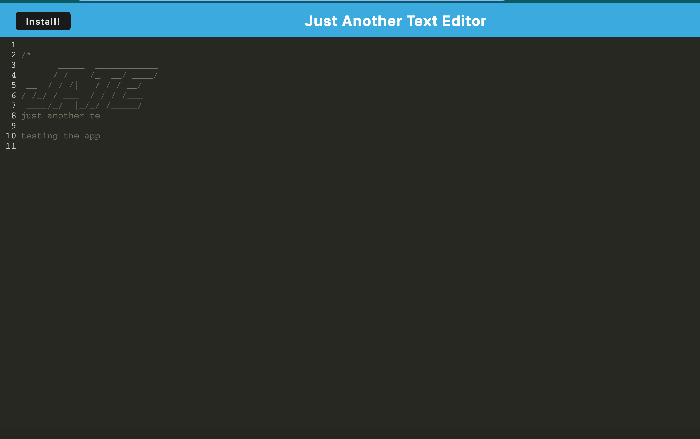

# Text-Editor

A Progressive Web Application that allows a user to save notes / texts offline

# Inspiration

A project that allows a user to save text notes online. Provides experience of working with Progressive Web Apps.

# Further Development

The editor could be configured for specific industries, with some pre populated headings as well as a blank template. Allowing the user to organise text files and use while on the go. It's also a little slow loading and giving the prompt to install. 

# Challenges

Getting the server to run and display the app. Also very challenging trying to deploy the product to Heroku.

# Usage instructions

Run npm i in the terminal, to install the dependencies, then npm run start. Go over to the localhost browser and click install, to install the app and use offline.

# Technologies

Javascript
Webpack
HTML
CSS
Node JS

# Created by

Carla Brown

djmisscbrown@hotmail.com

https://github.com/misscbrown

## Acceptance Criteria

```md
GIVEN a text editor web application
WHEN I open my application in my editor
THEN I should see a client server folder structure
WHEN I run `npm run start` from the root directory
THEN I find that my application should start up the backend and serve the client
WHEN I run the text editor application from my terminal
THEN I find that my JavaScript files have been bundled using webpack
WHEN I run my webpack plugins
THEN I find that I have a generated HTML file, service worker, and a manifest file
WHEN I use next-gen JavaScript in my application
THEN I find that the text editor still functions in the browser without errors
WHEN I open the text editor
THEN I find that IndexedDB has immediately created a database storage
WHEN I enter content and subsequently click off of the DOM window
THEN I find that the content in the text editor has been saved with IndexedDB
WHEN I reopen the text editor after closing it
THEN I find that the content in the text editor has been retrieved from our IndexedDB
WHEN I click on the Install button
THEN I download my web application as an icon on my desktop
WHEN I load my web application
THEN I should have a registered service worker using workbox
WHEN I register a service worker
THEN I should have my static assets pre cached upon loading along with subsequent pages and static assets
WHEN I deploy to Heroku
THEN I should have proper build scripts for a webpack application
```

# Link to deployed app

https://code-editor-offline-carla.herokuapp.com/


